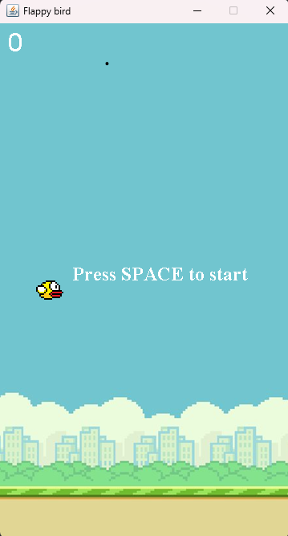

# FlappyBird Java game

A recreation of classical Flappy bird game built in java using swing.
You need to pass through each pipe without hitting one. If collided, games is over 👾.

## Features

- Move FlappyBird using **SpaceBar**.
- Each time you pass through pipes, your **score** increases.
- Restart the game using **spacebar**.
- Smooth **graphics** for realistic bird movement.
- Press **p** to pause the game and **s** to start the game.
- When the game starts, a **3-second timer** is shown on the screen for the players to get ready.
- Whenever you get a score higher than the previous one, the **highest score** is stored automatically.

## How to Play 🎮

- Clone the repository.
- Run FlappyBird.java in your preferred Java IDE such as Intellij IDEA, eclipse or VS Code.
- Pass through each pipes by pressing spacebar.
- You can pause and start the game using the **P** and **S** keys. 

## Technologies 
- Java 8+
- Java Swing(for GUI)
- Timer (game Loop)
- Action Listener and Event Listener 
- Live score count

## Notes

- This project is for **learning purposes**. You can add new features such as sparking animation when flappybird hits the pipe, or like the original one, add mario at the end of game. When they collide, either FlappyBird or mario can win.

## Developed by: Sahil Bdr. Devkota
## Github: (https://github.com/SahilDevkota)
